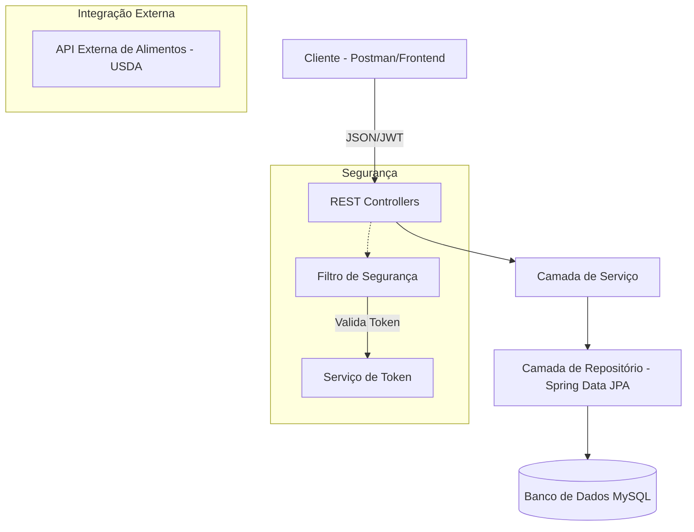
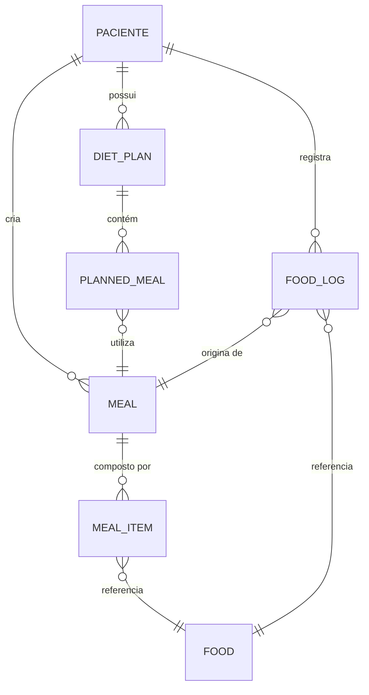
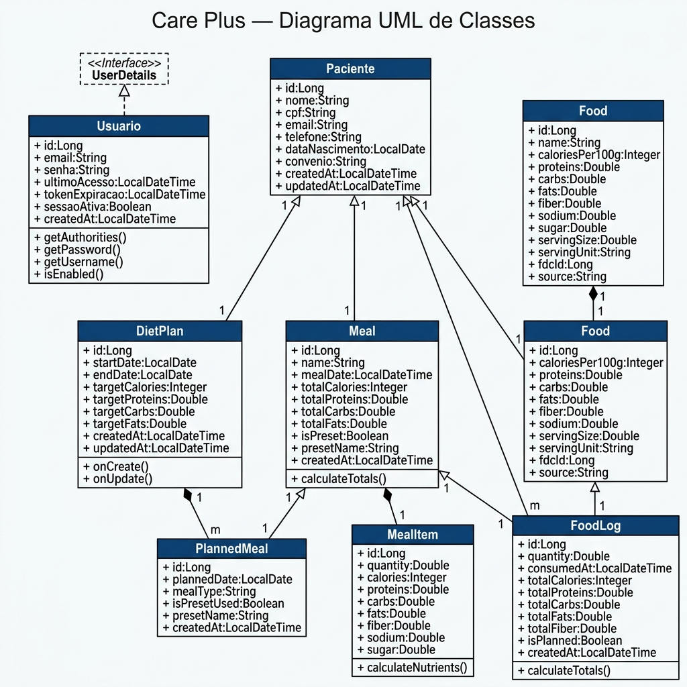
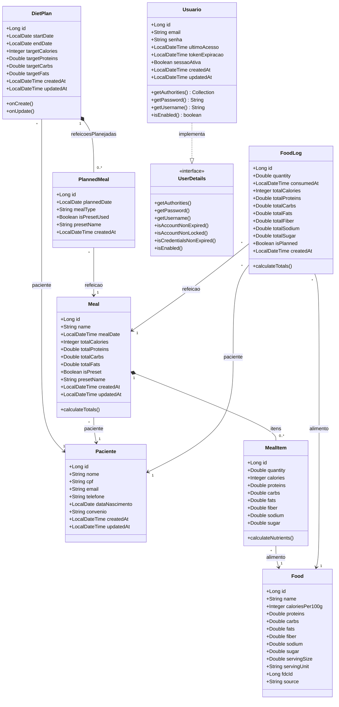

# 🏗️ Care Plus — Arquitetura do Sistema e Documentação da API

Bem-vindo à documentação técnica do **Care Plus**, um sistema robusto de gerenciamento de dietas e nutrição. Este documento descreve a arquitetura do sistema, os modelos de dados e a estrutura dos endpoints da API.

---

## 🏛️ Arquitetura do Sistema

O Care Plus segue uma **Arquitetura em Camadas** moderna, construída sobre o ecossistema **Spring Boot**. Essa separação de responsabilidades garante escalabilidade, manutenibilidade e limites claros entre a lógica de negócio e a infraestrutura.

### 🧩 Camadas Principais



| Camada | Responsabilidade |
| :--- | :--- |
| **Controller** | Recebe requisições HTTP, valida entradas e serializa respostas em JSON. |
| **Service** | Orquestra regras de negócio, transações e lógica interna. |
| **Repository** | Abstração para operações de banco de dados via Spring Data JPA. |
| **Model** | Entidades JPA que representam o domínio de negócio. |
| **Security** | Autenticação e autorização baseadas em JWT com Spring Security. |

---

## 🔐 Fluxo de Autenticação

O sistema utiliza **JWT (JSON Web Token)** para acesso seguro.

1. **Endpoint**: `POST /login`
2. **Payload de Entrada**: `{ "login": "...", "senha": "..." }`
3. **Resposta**: `{ "token": "..." }`
4. **Uso**: Incluir o token no cabeçalho `Authorization: Bearer <token>` em todas as requisições protegidas.

---

## 📡 Estrutura dos Endpoints da API

### 🍱 Gerenciamento de Alimentos
Endpoints para gerenciar o banco de dados de alimentos, com integração híbrida (banco local + API externa USDA).

| Método | Endpoint | Descrição |
| :--- | :--- | :--- |
| `GET` | `/api/foods` | Listar todos os alimentos disponíveis. |
| `GET` | `/api/foods/{id}` | Buscar informações nutricionais por ID. |
| `GET` | `/api/foods/nome/{nome}` | Buscar alimento por nome exato. |
| `GET` | `/api/foods/buscar?nome=...` | Buscar alimentos por parte do nome. |
| `POST` | `/api/foods` | Cadastrar um novo alimento. |
| `PUT` | `/api/foods/{id}` | Atualizar dados nutricionais. |
| `DELETE` | `/api/foods/{id}` | Remover um alimento. |

### 👥 Gerenciamento de Pacientes
| Método | Endpoint | Descrição |
| :--- | :--- | :--- |
| `GET` | `/api/pacientes` | Listar todos os pacientes cadastrados. |
| `GET` | `/api/pacientes/{id}` | Buscar perfil do paciente por ID. |
| `GET` | `/api/pacientes/cpf/{cpf}` | Buscar paciente por CPF. |
| `POST` | `/api/pacientes` | Cadastrar novo paciente. |
| `PUT` | `/api/pacientes/{id}` | Atualizar dados do paciente. |
| `DELETE` | `/api/pacientes/{id}` | Remover paciente do sistema. |

### 🥗 Planos Alimentares
| Método | Endpoint | Descrição |
| :--- | :--- | :--- |
| `GET` | `/api/diet-plans` | Listar todos os planos alimentares. |
| `GET` | `/api/diet-plans/paciente/{id}` | Buscar planos de um paciente específico. |
| `POST` | `/api/diet-plans/paciente/{id}` | Criar novo plano para um paciente. |
| `POST` | `/api/diet-plans/{id}/refeicao-preset` | Adicionar refeição pré-definida ao plano. |
| `POST` | `/api/diet-plans/{id}/refeicao-custom` | Adicionar refeição customizada ao plano. |

### 📝 Registro de Consumo Alimentar
| Método | Endpoint | Descrição |
| :--- | :--- | :--- |
| `GET` | `/api/food-logs` | Listar todos os registros de consumo. |
| `GET` | `/api/food-logs/paciente/{id}` | Histórico de consumo de um paciente. |
| `GET` | `/api/food-logs/paciente/{id}/calorias` | Total de calorias do paciente em uma data. |
| `POST` | `/api/food-logs/paciente/{id}` | Registrar novo consumo (Preset, Custom ou Direto). |
| `DELETE` | `/api/food-logs/{id}` | Remover um registro de consumo. |

### 🍴 Refeições Pré-definidas (Presets)
| Método | Endpoint | Descrição |
| :--- | :--- | :--- |
| `GET` | `/api/meals` | Listar todos os presets de refeição. |
| `POST` | `/api/meals` | Criar novo preset com múltiplos alimentos. |
| `GET` | `/api/meals/{id}` | Detalhes de um preset de refeição. |

---

## 📊 Modelos de Dados (Entidades)

### 🧬 Diagrama de Entidade e Relacionamento (ER)



---

## 🗂️ Diagrama UML de Classes

Diagrama completo com todos os atributos, tipos e relacionamentos entre as 8 entidades de domínio e o modelo de segurança.





---

## 🚀 Integração com API Externa: FoodData Central (USDA)

O sistema integra-se com a **API FoodData Central (USDA)** para fornecer uma vasta base de dados nutricionais confiáveis.

### 🔄 Detalhes da Implementação
- **Provedor**: FoodData Central (USDA)
- **Tecnologia**: Spring WebClient (Reativo)
- **Pacote**: `com.fiap.begin_projetct.service` (FoodService)
- **Lógica de Busca Híbrida**:
    1. O sistema consulta primeiro o banco de dados local.
    2. Se menos de 5 resultados forem encontrados, consulta automaticamente a API do USDA.
    3. Os resultados da API são mapeados para a entidade `Food` e armazenados em cache no MySQL local.
    4. Duplicatas são evitadas verificando o campo `fdc_id`.

### 🛠️ Configuração Necessária
Propriedade obrigatória no `application.properties`:
```properties
fooddata.api.key=SUA_CHAVE_AQUI
```

---

## 🛠️ Stack Tecnológica

| Componente | Tecnologia | Versão |
| :--- | :--- | :--- |
| Linguagem | Java | 21 |
| Framework | Spring Boot | 3.4.1 |
| Banco de Dados | MySQL | 8.0 |
| Segurança | Spring Security + JWT (auth0) | 4.5.1 |
| Documentação | Swagger UI / OpenAPI | 3.0 (springdoc 2.7.0) |
| Migrações de Banco | Flyway | Incluso no Spring Boot 3.x |
| Ferramenta de Build | Maven | 3.x |
| Redução de Boilerplate | Lombok | - |
| HTTP Reativo | Spring WebFlux / WebClient | - |

---
*Documentação gerada por Antigravity AI — atualizada em 07/05/2026.*
