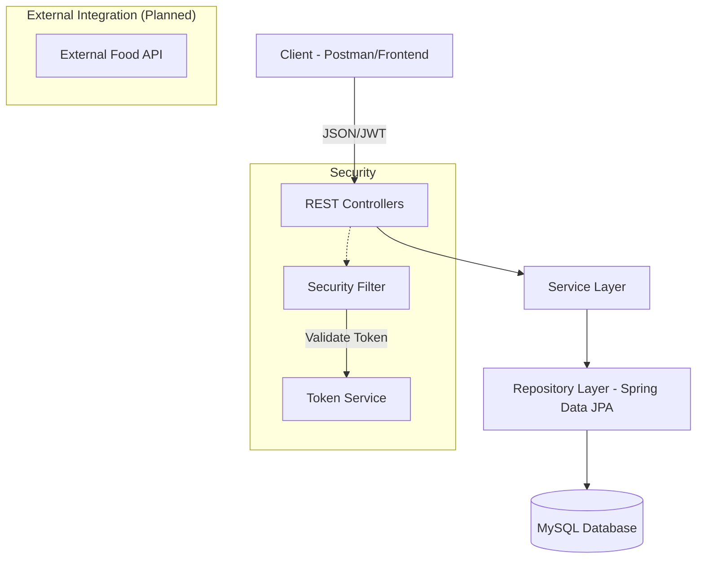
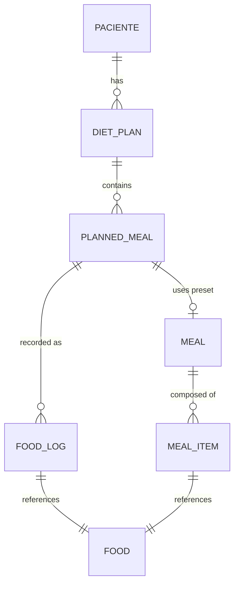

# 🏗️ Care Plus - System Architecture & API Documentation

Welcome to the technical documentation for **Care Plus**, a robust diet and nutrition management system. This document outlines the system's architecture, data models, and API endpoint structure to support the transition to external data services.

---

## 🏛️ System Architecture

Care Plus follows a modern **Layered Architecture** built on the **Spring Boot** ecosystem. This separation of concerns ensures scalability, maintainability, and clear boundaries between business logic and infrastructure.

### 🧩 Core Layers



| Layer | Responsibility |
| :--- | :--- |
| **Controller** | Handles HTTP requests, input validation, and maps models to JSON. |
| **Service** | Orchestrates business rules, transactions, and internal logic. |
| **Repository** | Abstraction for database operations using Spring Data JPA. |
| **Model** | JPA Entities representing the core business domain. |
| **Security** | JWT-based authentication and authorization using Spring Security. |

---

## 🔐 Authentication Flow

The system uses **JWT (JSON Web Token)** for secure access.

1.  **Endpoint**: `POST /login`
2.  **Payload**: `{ "login": "...", "senha": "..." }`
3.  **Response**: `{ "token": "..." }`
4.  **Usage**: Include the token in the `Authorization: Bearer <token>` header for all protected requests.

---

## 📡 API Endpoints Structure

### 🍱 Food Management (Target for External API Replacement)
These endpoints are used to manage the food database. The goal is to replace the local database storage with an external provider (e.g., Nutritionix, Edamam).

| Method | Endpoint | Description |
| :--- | :--- | :--- |
| `GET` | `/api/foods` | List all available foods. |
| `GET` | `/api/foods/{id}` | Get detailed nutritional info by ID. |
| `GET` | `/api/foods/nome/{nome}` | Find food by exact name. |
| `GET` | `/api/foods/buscar?nome=...` | Search foods by partial name. |
| `POST` | `/api/foods` | Register a new food item. |
| `PUT` | `/api/foods/{id}` | Update food nutritional data. |
| `DELETE` | `/api/foods/{id}` | Remove a food item. |

### 👥 Patient Management
| Method | Endpoint | Description |
| :--- | :--- | :--- |
| `GET` | `/api/pacientes` | List all registered patients. |
| `GET` | `/api/pacientes/{id}` | Get patient profile by ID. |
| `GET` | `/api/pacientes/cpf/{cpf}` | Find patient by CPF. |
| `POST` | `/api/pacientes` | Register a new patient. |
| `PUT` | `/api/pacientes/{id}` | Update patient information. |
| `DELETE` | `/api/pacientes/{id}` | Delete a patient profile. |

### 🥗 Diet Plans & Planning
| Method | Endpoint | Description |
| :--- | :--- | :--- |
| `GET` | `/api/diet-plans` | List all diet plans. |
| `GET` | `/api/diet-plans/paciente/{id}` | Get plans for a specific patient. |
| `POST` | `/api/diet-plans/paciente/{id}` | Create a new plan for a patient. |
| `POST` | `/api/diet-plans/{id}/refeicao-preset` | Add a pre-defined meal to a plan. |
| `POST` | `/api/diet-plans/{id}/refeicao-custom` | Add a custom meal to a plan. |

### 📝 Food Consumption Logs
| Method | Endpoint | Description |
| :--- | :--- | :--- |
| `GET` | `/api/food-logs` | List all consumption logs. |
| `GET` | `/api/food-logs/paciente/{id}` | Get consumption history for a patient. |
| `GET` | `/api/food-logs/paciente/{id}/calorias` | Get total calories for a patient on a specific date. |
| `POST` | `/api/food-logs/paciente/{id}` | Register a new consumption (Preset, Custom, or Direct). |
| `DELETE` | `/api/food-logs/{id}` | Remove a consumption entry. |

### 🍴 Meal Presets
| Method | Endpoint | Description |
| :--- | :--- | :--- |
| `GET` | `/api/meals` | List all meal presets. |
| `POST` | `/api/meals` | Create a new meal preset with multiple food items. |
| `GET` | `/api/meals/{id}` | Get details of a meal preset. |

---

## 📊 Data Models (Entities)

### 🥑 Food Entity
The core model for nutritional tracking.

- `id`: Unique identifier (Long)
- `name`: Food name (String, 100 chars)
- `caloriesPer100g`: Kcal per 100g (Integer)
- `proteins`, `carbs`, `fats`: Macronutrients in grams (Double)
- `fiber`, `sodium`, `sugar`: Micronutrients (Double)
- `servingSize`: Standard portion size (Double)
- `servingUnit`: Unit of measure (e.g., "g", "ml")

### 🧬 Entity Relationship Diagram



---

## 🚀 External Food API Integration: FoodData Central

The system now integrates with the **FoodData Central API (USDA)** to provide a vast database of nutritional information.

### 🔄 Implementation Details
- **Provider**: FoodData Central (USDA)
- **Technology**: Spring WebClient (Reactive)
- **Package**: `com.careplus.external.fooddata`
- **Logic**: 
    1. The system searches the local database first.
    2. If less than 5 matches are found, it queries the FoodData Central API.
    3. Results from the API are automatically mapped to the `Food` entity and cached in the local MySQL database.
    4. Duplicates are prevented by checking the `fdc_id`.

### 🛠️ Configuration
Required property in `application.properties`:
```properties
fooddata.api.key=YOUR_API_KEY
```

---

## 🛠️ Technology Stack

- **Language**: Java 17+
- **Framework**: Spring Boot 3.x
- **Database**: MySQL 8.0 (configured in `application.properties`)
- **Security**: Spring Security + JWT
- **Documentation**: Swagger UI (OpenAPI 3.0)
- **Build Tool**: Maven

---
*Documentation generated by Antigravity AI.*
